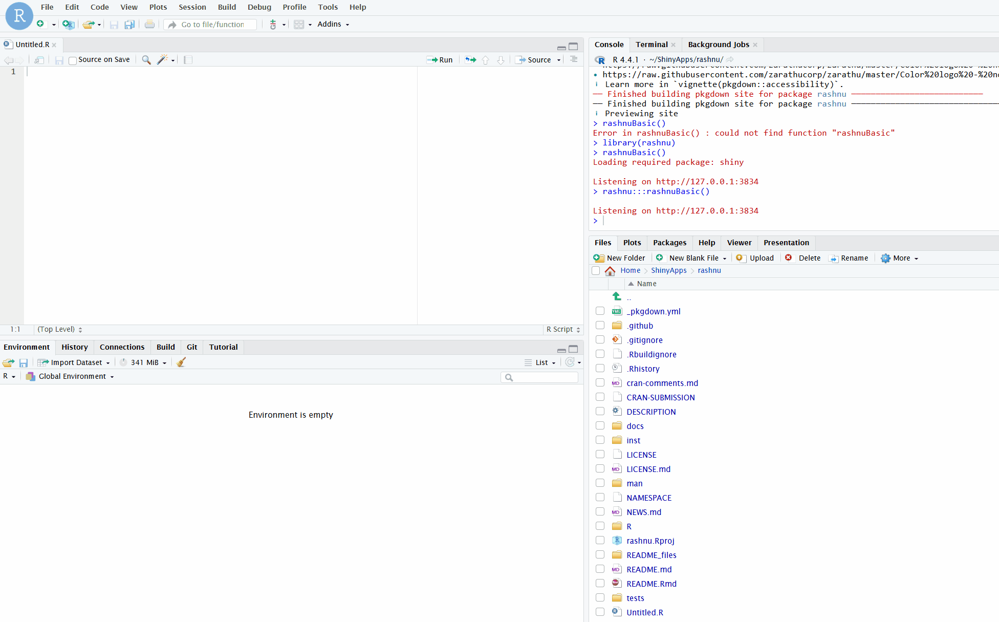

<!-- badges: start -->

[](https://github.com/zarathucorp/rashnu/actions/workflows/R-CMD-check.yaml)
[](https://CRAN.R-project.org/package=rashnu)
[](https://cranlogs.r-pkg.org/badges/rashnu)
[](LICENSE)
[](https://github.com/zarathucorp/rashnu/issues)
[](https://github.com/zarathucorp/rashnu/stargazers)
[](https://app.codecov.io/gh/zarathucorp/rashnu)
<!-- badges: end -->

# Rashnu

**Rashnu** is the Zoroastrian deity of truth and justice—the one who
weighs souls on a golden scale.  
This R package, developed by **Zarathu**, draws inspiration from
Rashnu’s role as the divine judge to offer precision and fairness in
sample size determination.

> *“Where truth is weighed, science begins.”*

------------------------------------------------------------------------

In clinical trials and research design, every decision matters.  
**Rashnu** helps researchers define the *right* number of participants
for various statistical tests including: - Non-inferiority studies - Superiority comparisons (Lakatos
method) - One-arm survival designs with transformation-based inference

This package brings clarity, rigor, and justice to your design process.

## Installation

You can install the stable version of rashnu from CRAN with:

``` r
install.packages("rashnu")
```

To access the latest development version, install it from GitHub with:

``` r
# install.packages("pak")
pak::pak("zarathucorp/rashnu")
```

## Example

### Rstudio Addins

Use `rashnuBasic()` or Click **Interactive Sample Size Calculator**
Addin

``` r
rashnuBasic()
```



### Two sample survival non-inferiority

``` r
twoSurvSampleSizeNI(
   syear = 12,
   yrsurv1 = 0.5,
   yrsurv2 = 0.5,
   alloc = 1,
   accrualTime = 24,
   followTime = 24,
   alpha = 0.025,
   power = 0.8,
   margin = 1.3
)
```

``` r
$Sample_size_of_standard_group
[1] 264

$Sample_size_of_test_group
[1] 264

$Total_sample_size
[1] 528

$Expected_event_numbers_of_standard_group
[1] 227.9

$Expected_event_numbers_of_test_group
[1] 227.9

$Total_expected_event_numbers
[1] 455.9
```

### Two sample survival superiority

``` r
lakatosSampleSize(
   syear = 12,
   yrsurv1 = 0.3,
   yrsurv2 = 0.5,
   alloc = 1,
   accrualTime = 24,
   followTime = 24,
   alpha = 0.05,
   power = 0.8,
   method = "logrank",
   side = "two.sided"
)
```

``` r
$Sample_size_of_standard_group
[1] 58

$Sample_size_of_test_group
[1] 58

$Total_sample_size
[1] 116

$Expected_event_numbers_of_standard_group
[1] 55.6

$Expected_event_numbers_of_test_group
[1] 49.7

$Total_expected_event_numbers
[1] 105.3

$Actual_power
[1] 0.803
```

### One sample non-parametric survival

``` r
oneSurvSampleSize(
   survTime = 12,
   p1 = 0.3,
   p2 = 0.4,
   accrualTime = 24,
   followTime = 24,
   alpha = 0.05,
   power = 0.8,
   side = "two.sided",
   method = "log-log"
)
```

``` r
SampleSize      Power 
   189.000      0.802 
```

### Test one mean
``` r
# 2-Sided Equality
one_mean_size(mu = 2, mu0 = 1.5, sd = 1, alpha = 0.05, beta = 0.2, test_type = "2-side")
[1] 32
one_mean_size(mu = 2, mu0 = 1.5, sd = 1, alpha = 0.05, n = 32, test_type = "2-side")
[1] 0.8074304

# 1-Sided
one_mean_size(mu = 115, mu0 = 120, sd = 24, alpha = 0.05, beta = 0.2, test_type = "1-side")
[1] 143
one_mean_size(mu = 115, mu0 = 120, sd = 24, alpha = 0.05, n = 143, test_type = "1-side")
[1] 0.8013493

# Non-Inferiority or Superiority
one_mean_size(mu = 2, mu0 = 1.5, delta = -0.5, sd = 1, alpha = 0.05, beta = 0.2, test_type = "non-inferiority")
[1] 7
one_mean_size(mu = 2, mu0 = 1.5, delta = -0.5, sd = 1, alpha = 0.05, n = 7, test_type = "non-inferiority")
[1] 0.8415708

# Equivalence
one_mean_size(mu = 2, mu0 = 2, delta = 0.05, sd = 0.1, alpha = 0.05, beta = 0.2, test_type = "equivalence")
[1] 35
one_mean_size(mu = 2, mu0 = 2, delta = 0.05, sd = 0.1, alpha = 0.05, n = 35, test_type = "equivalence")
[1] 0.810884
```

### Compare two means
``` r
# 2-Sided Equality
two_mean_size(muA = 5, muB = 10, kappa = 1, sd = 10, alpha = 0.05, beta = 0.2, test_type = "2-side")
[1] 63
two_mean_size(muA = 5, muB = 10, kappa = 1, sd = 10, alpha = 0.05, nB = 63, test_type = "2-side")
[1] 0.8013024


# 1-Sided
two_mean_size(muA = 132.86, muB = 127.44, kappa = 2, sdA = 15.34, sdB = 18.23, alpha = 0.05, beta = 0.2, test_type = "1-side")
[1] 85
two_mean_size(muA = 132.86, muB = 127.44, kappa = 2, sdA = 15.34, sdB = 18.23, alpha = 0.05, nA = 85, test_type = "1-side")
[1] 0.8020669

# Non-Inferiority or Superiority
two_mean_size(muA = 5, muB = 5, delta = 5, kappa = 1, sd = 10, alpha = 0.05, beta = 0.2, test_type = "non-inferiority")
[1] 50
two_mean_size(muA = 5, muB = 5, delta = 5, kappa = 1, sd = 10, alpha = 0.05, nB = 50, test_type = "non-inferiority")
[1] 0.8037819

# Equivalence
two_mean_size(muA = 5, muB = 4, delta = 5, kappa = 1, sd = 10, alpha = 0.05, beta = 0.2, test_type = "equivalence")
[1] 108
two_mean_size(muA = 5, muB = 4, delta = 5, kappa = 1, sd = 10, alpha = 0.05, nB = 108, test_type = "equivalence")
[1] 0.8045235
```

### Compare k Means (1-way ANOVA pairwise)
``` r
# 2-Sided Equality
k_mean_size(muA = 5, muB = 10, sd = 10, tau = 1, alpha = 0.05, beta = 0.2, test_type = "2-side")
[1] 63
k_mean_size(muA = 5, muB = 10, sd = 10, tau = 1, alpha = 0.05, n = 63, test_type = "2-side")
[1] 0.8013024

# 1-Sided
k_mean_size(muA = 132.86, muB = 127.44, kappa = 2, sdA = 15.34, sdB = 18.23, tau = 1, alpha = 0.05, beta = 0.2, test_type = "1-side")
[1] 85
k_mean_size(muA = 132.86, muB = 127.44, kappa = 2, sdA = 15.34, sdB = 18.23, tau = 1, alpha = 0.05, nA = 85, test_type = "1-side")
[1] 0.8020669
```

### Test one proportion
``` r
# 2-Sided Equality
one_prop_size(p = 0.5, p0 = 0.3, alpha = 0.05, beta = 0.2, test_type = "2-side")
[1] 50
one_prop_size(p = 0.5, p0 = 0.3, alpha = 0.05, n = 50, test_type = "2-side")
[1] 0.8074304

# 1-Sided
one_prop_size(p = 0.05, p0 = 0.02, alpha = 0.05, beta = 0.2, test_type = "1-side")
[1] 191
one_prop_size(p = 0.05, p0 = 0.02, alpha = 0.05, n = 191, test_type = "1-side")
[1] 0.8011562

# Non-inferiority or Superiority
one_prop_size(p = 0.5, p0 = 0.3, delta = -0.1 ,alpha = 0.05, beta = 0.2, test_type = "non-inferiority")
[1] 18
one_prop_size(p = 0.5, p0 = 0.3, delta = -0.1, alpha = 0.05, n = 18, test_type = "non-inferiority")

# Equivalence
[1] 0.8161482
one_prop_size(p = 0.6, p0 = 0.6, delta = 0.2, alpha = 0.05, beta = 0.2, test_type = "equivalence")
[1] 52
one_prop_size(p = 0.6, p0 = 0.6, delta = 0.2, alpha = 0.05, n = 52, test_type = "equivalence")
[1] 0.8060834
```

### Compare two proportion
``` r
# 2-Sided Equality
two_prop_size(pA = 0.65, pB = 0.85, kappa = 1, alpha = 0.05, beta = 0.2, test_type = "2-side")
[1] 70
two_prop_size(pA = 0.65, pB = 0.85, kappa = 1, alpha = 0.05, nB = 70, test_type = "2-side")
[1] 0.8019139

# 1-Sided
two_prop_size(pA = 0.65, pB = 0.85, kappa = 1, alpha = 0.05, beta = 0.2, test_type = "1-side")
[1] 55
two_prop_size(pA = 0.65, pB = 0.85, kappa = 1, alpha = 0.05, nB = 55, test_type = "1-side")
[1] 0.8008219

# Non-inferiority or Superiority
two_prop_size(pA = 0.85, pB = 0.65, delta = -0.1, kappa = 1, alpha = 0.05, beta = 0.2, test_type = "non-inferiority")
[1] 25
two_prop_size(pA = 0.85, pB = 0.65, delta = -0.1, kappa = 1, alpha = 0.05, nB = 25, test_type = "non-inferiority")
[1] 0.8085998

# Equivalence
two_prop_size(pA = 0.65, pB = 0.85, delta = 0.05, kappa = 1, alpha = 0.05, beta = 0.2, test_type = "equivalence")
[1] 136
two_prop_size(pA = 0.65, pB = 0.85, delta = 0.05, kappa = 1, alpha = 0.05, nB = 136, test_type = "equivalence")
[1] 0.8033294
```

### Compare paired proportions (McNemar's Z-test)
``` r
# 2-Sided Equality
pair_prop_size(p01 = 0.45, p10 = 0.05, alpha = 0.1, beta = 0.1, test_type = "2-side")
[1] 23
pair_prop_size(p01 = 0.45, p10 = 0.05, alpha = 0.1, n = 23, test_type = "2-side")
[1] 0.9023805

# 1-Sided
pair_prop_size(p01 = 0.45, p10 = 0.05, alpha = 0.05, beta = 0.1, test_type = "1-side")
[1] 23
pair_prop_size(p01 = 0.45, p10 = 0.05, alpha = 0.05, n = 23, test_type = "1-side")
[1] 0.9023805
```

### Compare k Proportions (1-way ANOVA pairwise)
``` r
k_prop_size(pA = 0.2, pB = 0.4, tau = 2, alpha = 0.05, beta = 0.2)
[1] 96
k_prop_size(pA = 0.2, pB = 0.4, tau = 2, alpha = 0.05, n = 96)
[1] 0.8042732
```

### Test time-to-event data (Cox PH)
``` r
# 2-Sided Equaltiy
coxph_size(hr = 2, hr0 = 1, pE = 0.8, pA = 0.5, alpha = 0.05, beta = 0.2, test_type = "2-side")
[1] 82
coxph_size(hr = 2, hr0 = 1, pE = 0.8, pA = 0.5, alpha = 0.05, n = 82, test_type = "2-side")
[1] 0.8015214

# Non-inferiority or Superiority
coxph_size(hr = 2, hr0 = 1, pE = 0.8, pA = 0.5, alpha = 0.025, beta = 0.2, test_type = "non-inferiority")
[1] 82
coxph_size(hr = 2, hr0 = 1, pE = 0.8, pA = 0.5, alpha = 0.025, n = 82, test_type = "non-inferiority")
[1] 0.8015214

# Equivalence
coxph_size(hr = 1, delta = 0.5, pE = 0.8, pA = 0.5, alpha = 0.05, beta = 0.2, test_type = "equivalence")
[1] 172
coxph_size(hr = 1, delta = 0.5, pE = 0.8, pA = 0.5, alpha = 0.05, n = 172, test_type = "equivalence")
[1] 0.8021573
```

### Test odds ratio
``` r
# Equality
or_size(pA = 0.4, pB = 0.25, kappa = 1, alpha = 0.05, beta = 0.2, test_type = "equality")
[1] 156
or_size(pA = 0.4, pB = 0.25, kappa = 1, alpha = 0.05, nB = 156, test_type = "equality")
[1] 0.8020239

# Non-inferiority or Superiority
or_size(pA = 0.4, pB = 0.25, delta = 0.2, kappa = 1, alpha = 0.05, beta = 0.2, test_type = "non-inferiority")
[1] 242
or_size(pA = 0.4, pB = 0.25, delta = 0.2, kappa = 1, alpha = 0.05, nB = 242, test_type = "non-inferiority")
[1] 0.8007201

# Equivalence
or_size(pA = 0.25, pB = 0.25, delta = 0.5, kappa = 1, alpha = 0.05, beta = 0.2, test_type = "equivalence")
[1] 366
or_size(pA = 0.25, pB = 0.25, delta = 0.5, kappa = 1, alpha = 0.05, nB = 366, test_type = "equivalence")
[1] 0.8008593
```

### Test relative incidence in self controlled case series studies
``` r
# SCCS, Alt-2
sccs_size(p = 3, r = 42/365, alpha = 0.05, beta = 0.2)
[1] 54
sccs_size(p = 3, r = 42/365, alpha = 0.05, n = 54)
[1] 0.8072004
```

### Others
``` r
# One Sample Normal
one_norm_size(mu = 2, mu0 = 1.5, sd = 1, alpha = 0.05, beta = 0.2)
[1] 32
one_norm_size(mu = 2, mu0 = 1.5, sd = 1, alpha = 0.05, n = 32)
[1] 0.8074304

# One Sample Binomial
one_bino_size(p = 0.5, p0 = 0.3, alpha = 0.05, beta = 0.2)
[1] 50
one_bino_size(p = 0.5, p0 = 0.3, alpha = 0.05, n = 50)
[1] 0.8074304
```
